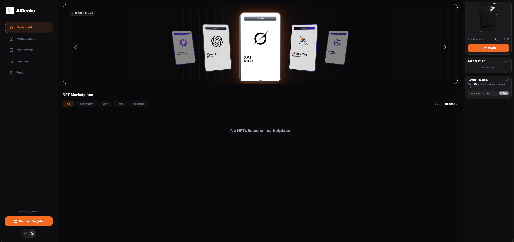
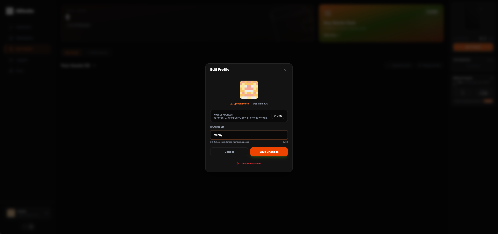
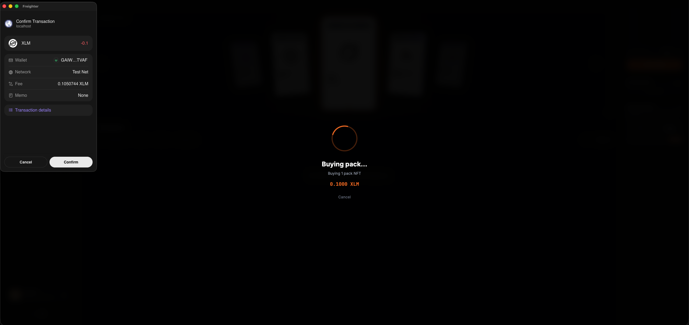
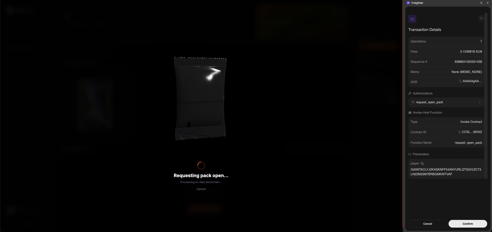
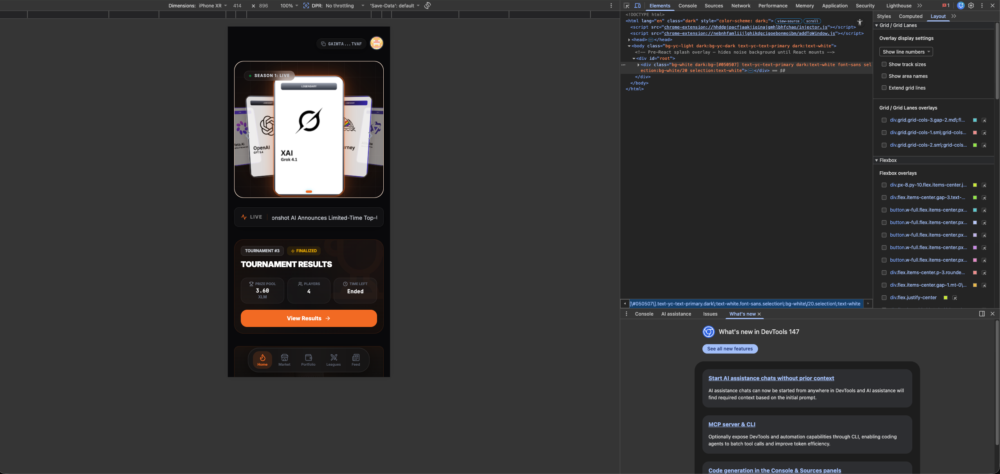
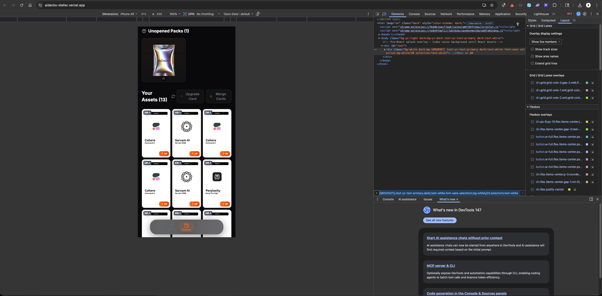
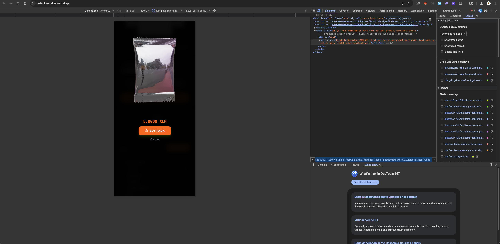
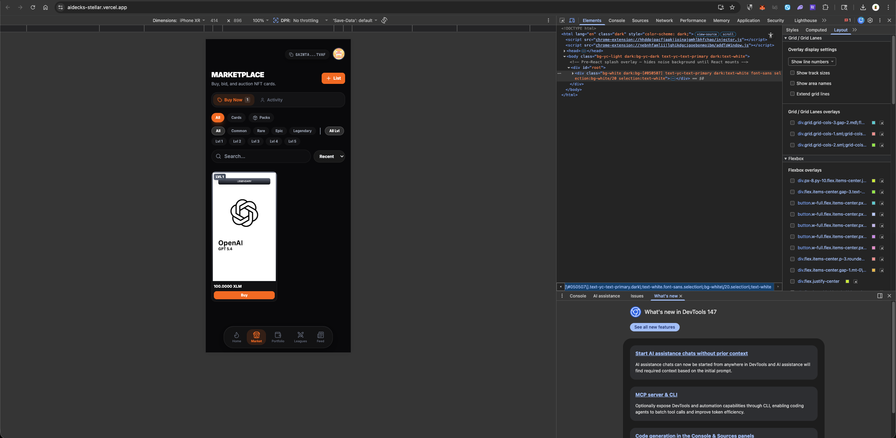
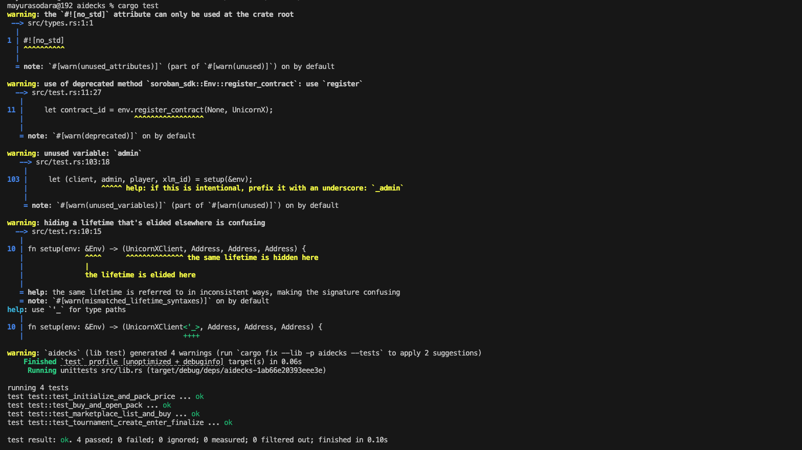

# AIDecks — Fantasy AI Trading Card Game on Stellar

A fully on-chain fantasy trading card game featuring 19 top AI companies (OpenAI, Anthropic, xAI, Cursor, Deepseek, etc.) as collectible NFT cards. Built on Stellar blockchain with Soroban smart contracts.

Demo Video: https://youtu.be/F3oGTv4SIqQ

## 🎮 Game Features

### Card System
- **19 AI Companies** as NFT cards with 4 rarity tiers:
  - **Legendary** (IDs 1-5): OpenAI, Anthropic, Google DeepMind, xAI, Midjourney
  - **Epic** (IDs 6-8): Meta AI, Alibaba, Z AI
  - **Rare** (IDs 9-13): Cursor, Deepseek, Windsurf, Antigravity, MiniMax
  - **Common** (IDs 14-19): Mistral AI, Kiro, Perplexity, Cohere, Moonshot AI, Sarvam AI
- **Pack Opening**: Buy packs (5 random cards per pack), request open, admin fulfills
- **Card Merging**: Combine 3 same-rarity cards → 1 higher-rarity card
- **Marketplace**: List cards for fixed XLM price, buy/sell with instant settlement

### Tournament System
- **Weekly Leagues**: Admin creates tournaments with registration/start/end times
- **Entry**: Lock 5 cards during registration window
- **Scoring**: Admin sets 19 startup scores, contract auto-calculates player totals
- **Prizes**: Auto-distributed on finalize (50% → 1st, 30% → 2nd, rest carries forward)
- **Leaderboard**: Real-time rankings with expandable squad view

### Marketplace
- **Fixed-price listings**: List any card for XLM
- **Transaction history**: View all your buys/lists/cancels via Stellar Horizon
- **My Activity**: Track active listings and past trades
- **Listed badge**: Cards on marketplace show blue "LISTED" tag

### AI Card Recommendation
- **Smart lineup suggestions**: AI analyzes your card collection + current startup scores to recommend the best 5 cards for tournament entry
- **Powered by OpenRouter**: Uses free LLM models (Gemma, Qwen, etc.) with automatic fallback chain
- **Context-aware**: Considers card rarity, level, and recent AI startup performance data

### Twitter/X Scoring Engine
Cards are scored daily based on real Twitter/X activity of each AI company:

| Event | Base Points |
|-------|------------|
| Funding round | 500–3000 (scales with amount) |
| Partnership announcement | 300+ (bonus for major partners) |
| Product launch / model release | 400 |
| Key hire (C-level) | 150–200 |
| Viral tweet (10k+ likes) | 200–500 |
| Benchmark result | 250 |
| Open source release | 350 |

**How it works**:
1. Daily cron runs at 00:10 UTC
2. Fetches tweets from each startup's Twitter handle via `twitterapi.io`
3. AI (OpenRouter LLM) classifies each tweet's event type
4. Points stored in `server/data/daily-scores/`
5. Aggregated scores (last 10 days) used for tournament scoring + AI recommendations
6. Live feed shows recent tweet events in the Feed section

### Admin Panel
- **Tournament Management**: Create, finalize with scores, cancel
- **Pack Price Control**: Set pack price in XLM
- **Stats Dashboard**: Packs sold, total NFTs, active tournament
- **Database Tools**: Clear news feed, reset leaderboard
- **Waitlist Export**: Download early access signups

---

## 🏗️ Architecture

### Smart Contract (Rust/Soroban)
**Location**: `contracts/aidecks/src/`

**Modules**:
- `lib.rs` — Main contract entry points
- `types.rs` — Data structures (CardData, TournamentData, CardListing, etc.)
- `card.rs` — NFT minting, merging, ownership
- `pack.rs` — Pack purchase, open requests, fulfillment
- `tournament.rs` — Create, enter, score, finalize, prize distribution
- `marketplace.rs` — List, buy, cancel listings
- `test.rs` — 4 integration tests

**Key Functions**:
```rust
// Packs
buy_pack(player, referrer?, tournament_id?) -> void
request_open_pack(player) -> void
open_pack(player, cards: Vec<(startup_id, rarity)>) -> void

// Cards
merge_cards(player, token_a, token_b, token_c, new_startup_id) -> void
get_card(token_id) -> Option<CardData>
get_cards_of(player) -> Vec<u32>

// Marketplace
list_card(seller, token_id, price) -> void
buy_listing(buyer, token_id) -> void
cancel_listing(seller, token_id) -> void

// Tournaments
create_tournament(reg_start, start_time, end_time) -> void
enter_tournament(player, tournament_id, card_ids: Vec<u32>) -> void
finalize_tournament(tournament_id, scores: Vec<u64>) -> void
get_tournament_players(tournament_id) -> Vec<Address>
get_player_lineup(tournament_id, player) -> Vec<u32>
```

### Backend (Node.js/Express)
**Location**: `server/`

**Routes**:
- `/api/packs` — Pack status, fulfillment
- `/api/tournaments` — Active tournament, list all
- `/api/leaderboard/:id` — Rankings with player lineups
- `/api/marketplace` — Listings scan, transaction history (Horizon)
- `/api/admin` — Create tournament, finalize, set prices
- `/api/cards` — Card metadata enrichment
- `/api/feed` — Activity feed
- `/api/startups` — AI company data

**Services**:
- `services/stellar.js` — SorobanRpc client, contract read/invoke helpers
- `config.js` — 19 AI companies with metadata

### Frontend (React/TypeScript/Vite)
**Location**: `frontend/`

**Key Components**:
- `Leagues.tsx` — Tournament UI, entry, leaderboard
- `Portfolio.tsx` — Card collection, merge, upgrade, sell
- `Marketplace.tsx` — Browse listings, buy cards, activity history
- `AdminPanel.tsx` — Tournament management, stats, database tools
- `PackOpeningModal.tsx` — Buy packs, card reveal animation

**Hooks**:
- `useNFT.ts` — Card fetching, merging
- `useTournament.ts` — Enter, score, lineup management
- `useMarketplaceV2.ts` — List, buy, cancel, history
- `useAdmin.ts` — Admin operations
- `usePacks.ts` — Buy, open packs
- `useLeaderboard.ts` — Rankings with squad data

**Wallet Integration**:
- Freighter wallet via `@stellar/freighter-api`
- `WalletContext.tsx` — Connection, balance, signing

---

## 🚀 Local Development

### 1. Contract
```bash
cd contracts/aidecks
cargo build --target wasm32-unknown-unknown --release
stellar contract optimize --wasm target/wasm32-unknown-unknown/release/aidecks.wasm

# Deploy to testnet
stellar contract deploy \
  --wasm target/wasm32-unknown-unknown/release/aidecks.wasm \
  --source aidecks-admin \
  --network testnet

# Initialize
stellar contract invoke \
  --id <CONTRACT_ID> \
  --source aidecks-admin \
  --network testnet \
  -- initialize \
  --admin <ADMIN_ADDRESS> \
  --xlm_token CDLZFC3SYJYDZT7K67VZ75HPJVIEUVNIXF47ZG2FB2RMQQVU2HHGCYSC \
  --pack_price 1000000
```

## 🌐 Current Deployment (Testnet)                                                                                                                                                              
                                                                                                                                                                                                  
| | Value |                                                                                                                                                                                     
|--|--|                                                                                                                                                                                         
| **Network** | Stellar Testnet |                                                                                                                                                               
| **Contract ID** | `CCIH2IGK6KAKRBTS4VNHAEHB4CK6OUIA3QWOCKEILVFFZ6V6N5XMITRG` |                                                                                                                
| **Admin Address** | `GCXKQ77XJHWKDGZ5ENGPSJEM22XZVRVYI5WO6JBCIHZGTS7TLSRV6SWW` |                                                                                                              
| **RPC URL** | `https://soroban-testnet.stellar.org` |                                                                                                                                         
| **Frontend** | https://aipacks-stellar.vercel.app |                                                                                                                                           
| **Backend** | https://aidecks.onrender.com |                                                                                                                                                  
| **Explorer** | [View on Stellar Expert](https://stellar.expert/explorer/testnet/contract/CCIH2IGK6KAKRBTS4VNHAEHB4CK6OUIA3QWOCKEILVFFZ6V6N5XMITRG) |                                          
                                                                                                                                                                                                  
> ⚠️ Currently on **testnet** — XLM used is test tokens with no real value. 

### 2. Backend
```bash
cd server
npm install

# Create .env
cat > .env << EOF
CONTRACT_ID=<your_contract_id>
ADMIN_SECRET_KEY=<your_admin_secret>
ADMIN_PUBLIC_KEY=<your_admin_address>
SOROBAN_RPC_URL=https://soroban-testnet.stellar.org
NETWORK_PASSPHRASE=Test SDF Network ; September 2015
PORT=5170
ADMIN_API_KEY=<generate_random_hex>
OPENROUTER_API_KEY=<get free key from openrouter.ai>
TWITTER_API_KEY=<get key from twitterapi.io>
EOF

node index.js
# Server runs on http://localhost:5170
```

### 3. Frontend
```bash
cd frontend
npm install

# Create .env
cat > .env << EOF
VITE_CONTRACT_ID=CCIH2IGK6KAKRBTS4VNHAEHB4CK6OUIA3QWOCKEILVFFZ6V6N5XMITRG
VITE_ADMIN_ADDRESS=GCXKQ77XJHWKDGZ5ENGPSJEM22XZVRVYI5WO6JBCIHZGTS7TLSRV6SWW
VITE_API_URL=http://localhost:5170
VITE_NETWORK=testnet
VITE_SOROBAN_RPC_URL=https://soroban-testnet.stellar.org
VITE_NETWORK_PASSPHRASE=Test SDF Network ; September 2015
EOF

npm run dev
# Frontend runs on http://localhost:5171
```

### 4. Run Tests
```bash
cd contracts/aidecks
cargo test
# Should show: 4 passed
```

---

## 📦 Tech Stack

**Blockchain**
- Stellar Soroban (Rust smart contracts)
- Freighter wallet
- Horizon API (transaction history)

**Backend**
- Node.js 18+
- Express 5
- @stellar/stellar-sdk v15
- node-cron (background jobs)

**Frontend**
- React 18
- TypeScript
- Vite
- TailwindCSS
- @stellar/freighter-api
- @tanstack/react-query
- Three.js (3D pack model)

---

## 📸 Screenshots                                                                                                                                                                                                                                                   
### Wallet Integration                                                                                                                                                                                                                                              
                                                                                                                                                                                                 
                                                                                                                                                                                               
                                                                                                                                                                                            
                                                                                                                                                                                                

### Mobile Responsive                                                                                                                                                                                                                                               
                                                                                                                                                                                               
                                                                                                                                                                                          
                                                                                                                                                                                            
                                                                                                                                                                                        
                                                                                                                                                                                                                                                                     
### Contract Tests                                                                                                                                                                                                                                                  



## 🎯 Game Flow

### For Players
1. **Connect Freighter** wallet
2. **Buy packs** (1 XLM = 5 cards)
3. **Open packs** from Portfolio → get random cards
4. **Merge cards** (3 same-rarity → 1 higher-rarity)
5. **Enter tournament** during registration (lock 5 cards) — use AI recommendation for best lineup
6. **Wait for results** — admin finalizes with AI startup scores from Twitter data
7. **Prizes auto-distributed** to top 2 players (50% / 30%)
8. **View past tournaments** in Leagues → Tournament History section
9. **Trade on marketplace** — list/buy cards anytime, view full trade history

### For Admins
1. **Create tournament** with 3 timestamps (reg/start/end)
2. **Wait for entries** and tournament to end
3. **Set 19 startup scores** in Admin Panel
4. **Click "Finalize & Pay"** → auto-calculates player scores, distributes prizes, unlocks cards
5. **Remaining prize pool** carries forward to next tournament

---

## 🔐 Security

- **Admin-only functions**: `create_tournament`, `finalize_tournament`, `open_pack`, `set_pack_price`
- **Player auth**: All player actions require `player.require_auth()`
- **Lock enforcement**: Cards locked in tournaments can't be merged/listed
- **Rarity validation**: `open_pack` validates startup_id matches expected rarity
- **Merge validation**: 3 same-rarity cards required, legendary can't merge
- **Marketplace safety**: Seller can't buy own listing, price > 0 enforced

---

## 📊 Contract State

**Instance Storage** (permanent):
- `Admin` — admin address
- `XlmToken` — native XLM token address
- `PackPrice` — price per pack in stroops

**Persistent Storage** (per-key TTL):
- `Card(token_id)` — CardData
- `CardOwner(token_id)` — Address
- `Tournament(id)` — TournamentData
- `Listing(token_id)` — CardListing
- `PlayerCards(player)` — Vec<u32>
- `PlayerLineup(tournament_id, player)` — Vec<u32>
- `PlayerScore(tournament_id, player)` — u64
- `StartupScores(tournament_id)` — Vec<u64> (19 scores)

**Counters**:
- `NextTokenId` — auto-increment for NFT IDs
- `NextTournamentId` — auto-increment for tournament IDs
- `TotalPacksSold` — global counter
- `PendingPacks(player)` — packs awaiting open
- `OpenRequests(player)` — open requests awaiting fulfillment

---

## 🎨 UI Highlights

- **Glassmorphism design** with backdrop blur
- **Dark mode** support
- **3D pack model** (Three.js GLB)
- **Card reveal animation** with explosion effect
- **Responsive** — mobile-first with bottom nav
- **Real-time updates** via polling hooks
- **Pixel art avatars** generated from wallet address
- **Referral system** (10% commission on pack sales)

---

## 📝 License

MIT

---

## 🤝 Contributing

1. Fork the repo
2. Create feature branch (`git checkout -b feature/amazing`)
3. Commit changes (`git commit -m 'Add amazing feature'`)
4. Push to branch (`git push origin feature/amazing`)
5. Open Pull Request

---

## 🐛 Known Issues

- Render free tier has 30s cold start on first request after sleep
- Horizon history only shows transactions after deployment (no retroactive data)
- Pack opening requires admin fulfillment (not instant)

---

## 🔮 Roadmap

- [ ] Instant pack opening (VRF-based randomness)
- [ ] Card leveling system (XP from tournament participation)
- [ ] Team tournaments (3v3 squads)
- [ ] Card staking for passive rewards
- [ ] Mobile app (React Native)

---


Built with ❤️ on Stellar
